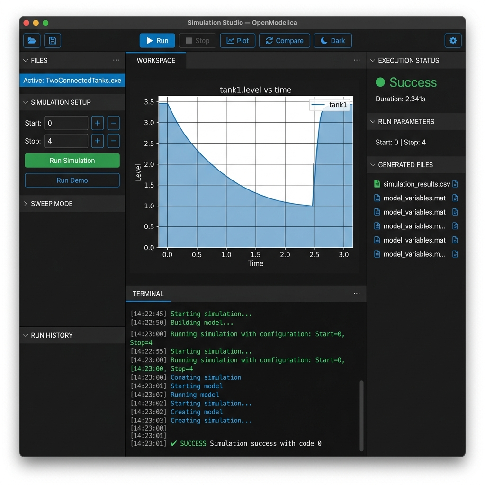
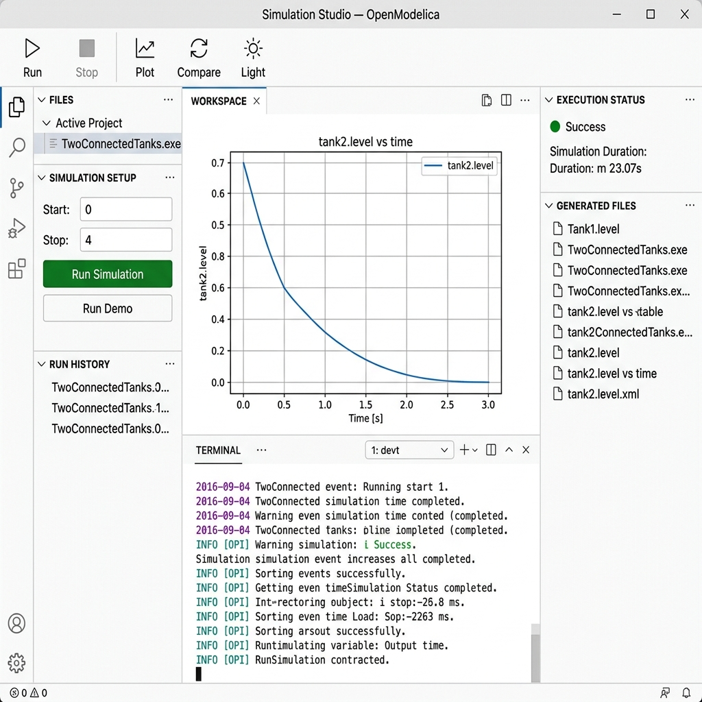
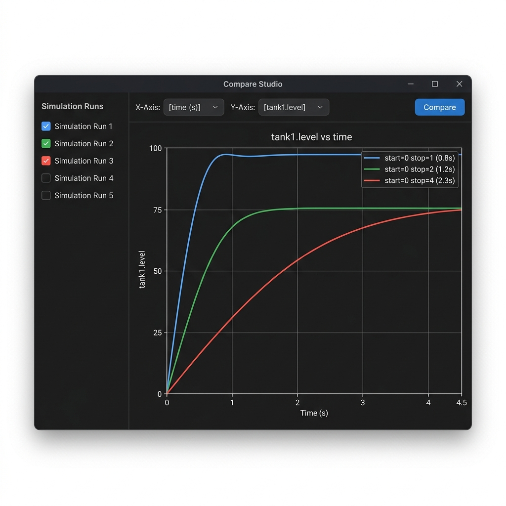

# ⚙ OpenModelica Simulation Studio v5.0

> A professional **PyQt6** desktop application for executing **OpenModelica**-generated simulation executables with real-time output streaming, interactive result visualization, parameter sweep, run comparison, and automated report generation.


---

## 📌 Project Title

**OpenModelica Simulation Studio** — A Desktop GUI for Running and Analyzing OpenModelica Simulations

---

## 🎯 Objective

The goal of this project is to build a **professional desktop application** using **Python (PyQt6)** that serves as a graphical front-end for **OpenModelica** simulation executables. The application allows users to:

1. **Select** any OpenModelica-compiled `.exe` simulation binary
2. **Configure** simulation parameters (start time, stop time) with validation
3. **Execute** the simulation as a subprocess with **real-time output streaming**
4. **Visualize** simulation results (CSV) as interactive **matplotlib** charts
5. **Compare** multiple simulation runs side-by-side on overlay graphs
6. **Sweep** parameters across multiple stop times in batch mode
7. **Export** results as ZIP archives or individual files
8. **Track** run history with persistent JSON storage

---

## 🛠 Tools & Technologies Used

| Tool / Technology | Purpose |
|---|---|
| **Python 3.10+** | Core programming language |
| **PyQt6** | Desktop GUI framework (Qt bindings for Python) |
| **Matplotlib** | Scientific data visualization & plotting |
| **OpenModelica** | Modelica-based simulation environment (generates `.exe` binaries) |
| **subprocess** | Running simulation executables from Python |
| **QThread** | Background execution to keep GUI responsive |
| **JSON** | Configuration persistence & run history storage |
| **CSV** | Simulation output data format |

---

## 📸 Screenshots

### 🌙 Dark Mode — Main Workspace


### ☀️ Light Mode — Main Workspace


### 🔄 Compare Studio — Multi-Run Overlay


---

## ✨ Features

### Core Simulation Features
| Feature | Description |
|---|---|
| **Executable Picker** | Browse and select any OpenModelica `.exe` binary |
| **File Inspector** | View file name, size, and last modified date |
| **Parameter Inputs** | Set start/stop time with validation (`0 ≤ start < stop < 5`) |
| **Command Preview** | See the exact command before running |
| **Input Validation** | Enforced constraints with descriptive error dialogs |
| **One-Click Demo** | Run with preset params (start=0, stop=4) instantly |

### Advanced Features
| Feature | Description |
|---|---|
| **Real-Time Output Streaming** | stdout/stderr streamed line-by-line via QThread |
| **Result File Auto-Detection** | Scans for .csv, .mat, .plt, .json after each run |
| **Interactive Graph Visualization** | Matplotlib plots with zoom, pan, save toolbar |
| **Parameter Sweep Mode** | Batch execution with multiple stop times |
| **Run Comparison Studio** | Overlay multiple runs on a single chart |
| **Execution Time Tracker** | Precise timing displayed in status bar |
| **Report Generator** | Auto-generates structured `.txt` reports per run |
| **Run History Panel** | Persistent clickable history with parameter reload |
| **Dark/Light Mode Toggle** | Full QSS theme switching with one click |
| **Configuration Save/Load** | Export/import simulation setup as JSON |
| **Result Export** | Download results as ZIP or copy to folder |
| **Workspace Layout** | VS Code-inspired multi-panel resizable splitters |

---

## 📁 Project Structure

```
OpenModelica-Simulation-Studio/
├── main.py                              # 🚀 Application entry point
├── requirements.txt                     # Python dependencies
├── README.md                            # This file
├── mock_simulation.bat                  # Demo simulation wrapper (Windows)
├── mock_sim_logic.py                    # Mock simulation engine (for demo)
│
├── core/                                # 🧠 Core Business Logic
│   ├── __init__.py
│   ├── simulation_runner.py             # QThread subprocess handler with timing
│   ├── sweep_runner.py                  # Batch parameter sweep executor
│   ├── validator.py                     # Input validation with dataclass results
│   ├── logger.py                        # HTML-formatted, color-coded log entries
│   ├── result_parser.py                 # CSV parsing, file scanning, column analysis
│   ├── report_generator.py              # Structured text report creation
│   ├── history_manager.py               # JSON-persisted run history management
│   ├── config_manager.py                # Configuration save/load handler
│   ├── export_manager.py                # ZIP and file export utilities
│   └── output_manager.py               # Run folder organization
│
├── gui/                                 # 🖥 User Interface
│   ├── __init__.py
│   ├── main_window.py                   # Main workspace with splitters & toolbar
│   ├── theme_manager.py                 # Centralized dark/light theme controller
│   ├── plot_widget.py                   # Standalone matplotlib chart widget
│   ├── compare_view.py                  # Multi-run comparison overlay view
│   ├── panels/                          # Modular UI Panels
│   │   ├── __init__.py
│   │   ├── control_panel.py             # Left sidebar: file picker, params, sweep
│   │   ├── console_panel.py             # Bottom terminal: real-time log output
│   │   ├── plot_panel.py                # Center: matplotlib visualization workspace
│   │   ├── inspector_panel.py           # Right sidebar: status, files, export
│   │   └── history_panel.py             # Left bottom: run history & compare
│   ├── widgets/                         # Custom Reusable Widgets
│   │   └── numeric_input.py             # Premium [−] [value] [+] numeric control
│   └── styles/                          # QSS Stylesheets
│       ├── dark_theme.qss               # VS Code-inspired dark theme (~14KB)
│       └── light_theme.qss              # Clean light theme (~14KB)
│
├── utils/                               # 🔧 Utility Functions
│   ├── __init__.py
│   └── file_handler.py                  # File dialog wrapper & metadata inspector
│
├── reports/                             # 📝 Auto-generated simulation reports
├── runs/                                # 📂 Organized per-run output folders
├── screenshots/                         # 📸 Application screenshots for README
│   ├── dark_mode.png
│   ├── light_mode.png
│   └── compare_view.png
└── .gitignore
```

---

## 🚀 How to Run the Application

### Prerequisites

- **Python 3.10** or later installed
- **pip** package manager
- **OpenModelica** (optional — a mock simulator is included for demo)

### Step 1: Clone the Repository

```bash
git clone https://github.com/<your-username>/OpenModelica-Simulation-Studio.git
cd OpenModelica-Simulation-Studio
```

### Step 2: Create Virtual Environment (Recommended)

```bash
# Windows
python -m venv venv
venv\Scripts\activate

# macOS / Linux
python3 -m venv venv
source venv/bin/activate
```

### Step 3: Install Dependencies

```bash
pip install -r requirements.txt
```

### Step 4: Launch the Application

```bash
python main.py
```

The application window will open with the full workspace layout.

---

## 📖 Usage Guide

### Selecting a Simulation Executable

1. Click **"Select Executable..."** in the left sidebar
2. Browse to your OpenModelica `.exe` file (e.g., `TwoConnectedTanks.exe`)
3. The file info will appear in the sidebar and inspector panel

> **💡 No OpenModelica?** Use the included `mock_simulation.bat` as a demo executable — it generates realistic simulation data.

### Setting Parameters

1. Use the **Start** and **Stop** time inputs (with `+` and `−` buttons)
2. Constraints: `0 ≤ start < stop < 5`
3. Click **▶ Run Simulation** to execute

### Example Inputs

| Parameter | Example Value | Description |
|---|---|---|
| **Executable** | `TwoConnectedTanks.exe` | OpenModelica compiled model |
| **Start Time** | `0` | Simulation begins at t=0 |
| **Stop Time** | `4` | Simulation ends at t=4 |
| **Command** | `TwoConnectedTanks.exe -override=startTime=0,stopTime=4` | Auto-generated |

### Quick Demo Mode

Click **⚡ Run Demo** to instantly execute with default parameters (`start=0`, `stop=4`).

### Viewing Results

- After simulation, output files are **auto-detected** in the inspector
- The plot workspace **auto-loads** the first CSV with numeric data
- Use **X/Y axis dropdowns** to select columns and click **Plot**
- Use the matplotlib **toolbar** to zoom, pan, and save charts

### Parameter Sweep

1. Expand the **SWEEP MODE** section in the sidebar
2. Enter comma-separated stop times: `1, 2, 3, 4`
3. Click **⚛ Run Sweep** — all runs execute sequentially
4. Results are logged in history for comparison

### Comparing Runs

1. Click **🔄 Compare** in the toolbar (or history panel)
2. Check 2+ runs with CSV outputs
3. Select shared X/Y columns
4. Click **Compare** to overlay results on one graph

### Exporting Results

- Click **⇓ Download Results** in the inspector panel
- Choose **ZIP archive** or **folder export**

---

## 📊 Example Output — Simulation Report

After each run, a structured report is saved to `reports/`:

```
============================================================
     OPENMODELICA SIMULATION REPORT
============================================================

TIMESTAMP:          2026-04-01 20:30:00
EXECUTABLE:         TwoConnectedTanks.exe
PATH:               D:\models\TwoConnectedTanks.exe

------------------------------------------------------------
SIMULATION PARAMETERS:
    Start Time:     0
    Stop Time:      4

------------------------------------------------------------
COMMAND EXECUTED:
    TwoConnectedTanks.exe -override=startTime=0,stopTime=4

------------------------------------------------------------
EXECUTION RESULTS:
    Status:         Success
    Return Code:    0
    Duration:       2.341 seconds

------------------------------------------------------------
OUTPUT FILES DETECTED:
    • simulation_results.csv

============================================================
          Generated by OpenModelica Simulation Runner v2.0
============================================================
```

---

## 🏗 Architecture

### Module Overview

| Module | Responsibility |
|--------|---------------|
| `core/simulation_runner.py` | QThread with Popen, real-time stdout/stderr streaming, execution timing |
| `core/sweep_runner.py` | Sequential batch execution across multiple stop times |
| `core/validator.py` | Pure validation logic with `ValidationResult` dataclass |
| `core/logger.py` | HTML-formatted, timestamped, color-coded console log entries |
| `core/result_parser.py` | CSV parsing, output file scanning, smart numeric detection |
| `core/report_generator.py` | Structured text report creation and automatic file saving |
| `core/history_manager.py` | JSON-persisted run history with entry management |
| `core/config_manager.py` | Simulation configuration save/load as JSON files |
| `core/export_manager.py` | ZIP archive and folder-based result export |
| `core/output_manager.py` | Timestamped run folder creation and organization |
| `gui/main_window.py` | Multi-panel workspace, toolbar, signal coordination |
| `gui/theme_manager.py` | Centralized QSS theme controller with plot color palettes |
| `gui/plot_widget.py` | Standalone matplotlib FigureCanvas with column selectors |
| `gui/compare_view.py` | Multi-run overlay comparison with theme-aware plotting |
| `gui/panels/control_panel.py` | Left sidebar with file picker, params, sweep mode |
| `gui/panels/console_panel.py` | Bottom terminal with monospace font and auto-scroll |
| `gui/panels/plot_panel.py` | Center visualization workspace with reactive theme |
| `gui/panels/inspector_panel.py` | Right sidebar with status cards, file list, export |
| `gui/panels/history_panel.py` | Run history list with reload and compare actions |
| `gui/widgets/numeric_input.py` | Custom [−] [value] [+] numeric input component |
| `utils/file_handler.py` | File dialog wrapper and metadata inspector |

### Application Flow

```
┌──────────────────────────────────────────────────────────────────┐
│                        main.py                                   │
│                   QApplication + MainWindow                      │
└──────────────────────┬───────────────────────────────────────────┘
                       │
         ┌─────────────┼─────────────┐
         ▼             ▼             ▼
   ControlPanel    PlotPanel    InspectorPanel
   (Left Sidebar)  (Center)    (Right Sidebar)
         │             ▲             ▲
         ▼             │             │
  SimulationRunner ────┘             │
  (QThread)                          │
         │                           │
         ▼                           │
  ResultParser ──── CSV Data ────────┘
         │
         ▼
  ReportGenerator ──► reports/sim_report_*.txt
  HistoryManager  ──► .run_history.json
```

---

## ⚠ Error Handling

| Scenario | Behavior |
|----------|----------|
| No file selected | Warning dialog with clear message |
| Invalid time inputs | Descriptive validation error with constraints |
| File not found at runtime | Error logged with full path |
| Permission denied | Error explanation with fix suggestion |
| CSV parse failure | Error shown in status label |
| Missing output files | Info message in console |
| Execution crash | Status → Failed, stderr displayed in terminal |
| Sweep validation | Per-run error reporting for invalid parameters |

---

## 🔧 Configuration

### Persistent Settings (`.sim_settings.json`)
```json
{
  "exe_path": "D:\\models\\TwoConnectedTanks.exe",
  "theme": "dark"
}
```

### Saved Configuration (exportable `.json`)
```json
{
  "exe_path": "D:\\models\\TwoConnectedTanks.exe",
  "start_time": 0,
  "stop_time": 4
}
```

---

## 🧪 Mock Simulation (For Demo Without OpenModelica)

If you don't have OpenModelica installed, the project includes a **mock simulator** that generates realistic data:

1. Select `mock_simulation.bat` as the executable in the app
2. Set start=0, stop=4  
3. Click **Run Simulation**
4. The mock engine generates a CSV with columns: `time`, `tank1.level`, `tank2.level`, `valve.flow`
5. Results auto-plot in the workspace

The mock simulator (`mock_sim_logic.py`) simulates a **Two Connected Tanks** system with damped oscillations and real-time step output.

---

## 📋 Dependencies

```
PyQt6>=6.6.0
matplotlib>=3.8.0
```

Install with:
```bash
pip install -r requirements.txt
```

---

## 🎨 Theming

The app ships with two professional QSS themes (~14KB each):

- **🌙 Dark Mode** — VS Code-inspired dark theme (#1E1E1E background)
- **☀️ Light Mode** — Clean, professional light theme (#FFFFFF background)

Toggle with one click in the toolbar. All components — including matplotlib plots — react immediately to theme changes.

---

## 🎥 Demo Video

> 📹 [Watch the Demo on Google Drive](#) *(Add your Google Drive link here)*

---

## 📄 License

MIT — use freely for educational and professional purposes.

---

## 👤 Author

Built as part of an academic project demonstrating Python GUI development with PyQt6 and OpenModelica simulation integration.
